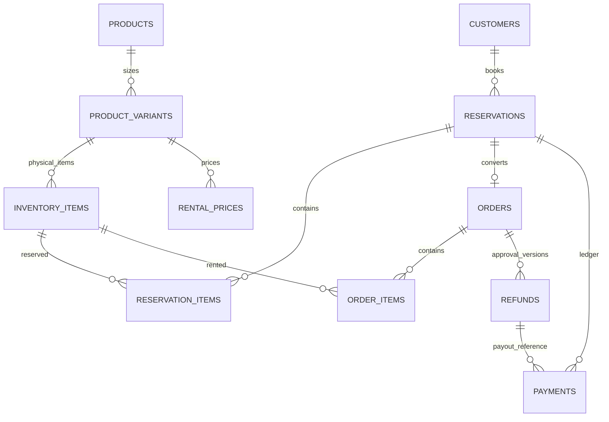

# Database tối giản — Aura Rental

## Dữ liệu development

Sau khi chạy `schema.sql`, nạp bộ dữ liệu test bằng:

```bash
docker exec -i postgres-db-1 psql -v ON_ERROR_STOP=1 -U postgres -d aura_rental < database/seed.sql
```

`seed.sql` dùng UUID cố định và UPSERT nên có thể chạy lại mà không nhân bản dữ liệu. File không xóa dữ liệu được tạo thủ công. Bộ seed gồm hai chi nhánh, ba tài khoản, catalog và giá `1D/2D/3D` theo từng chi nhánh, cùng reservation/order/refund ở nhiều trạng thái.

Bộ dữ liệu hiện có 16 mã đồ vật lý, 11 lượt giữ chỗ, 8 đơn hàng và 2 phiếu hoàn. Các case Hà Nội bao phủ giữ chỗ còn hạn/quá hạn, đơn thiếu cọc, chờ xác minh CCCD, đã xác nhận, đang chuẩn bị, đang thuê và đang kiểm đồ; trong hàng đợi trả có cả đơn chưa inspection và đơn đã gửi manager duyệt. Sài Gòn có giữ chỗ đang hoạt động và đơn đã hoàn tất để kiểm tra phân quyền/dữ liệu theo chi nhánh.

| Vai trò | Username | Email | Password development |
|---|---|---|---|
| Manager | `manager` | `manager@aurarental.local` | `Manager@123` |
| Staff Hà Nội | `hanoi` | `hanoi.staff@aurarental.local` | `Hanoi@123` |
| Staff Sài Gòn | `saigon` | `saigon.staff@aurarental.local` | `Saigon@123` |

Form công khai mẫu dùng token `mock-hn-reservation-token` và OTP `123456`. Hạn token được làm mới thành 24 giờ kể từ mỗi lần chạy lại seed.

Các password trên chỉ dùng local. Database lưu hash PBKDF2 có salt, không lưu password gốc. Frontend gọi `POST /api/v1/auth/login`; backend phát access token nội bộ sau khi xác thực thành công.

Có **15 bảng dữ liệu nghiệp vụ** cho multi-branch và một bảng kỹ thuật `idempotency_records`; không trigger, stored function, bảng audit/outbox hoặc bảng tài liệu PNG. [schema.sql](schema.sql) là nguồn DDL để khởi tạo database; backend không tự động chạy migration hay áp dụng file này.

## 1. Ý tưởng thiết kế

- Tách mẫu → size → từng mã vật lý để giữ lịch chính xác.
- Tách reservation khỏi order vì khách đã cọc giữ lịch có thể chưa gửi form.
- Tiền cọc/hoàn dùng chung `payments` theo reservation; không copy tiền khi tạo đơn.
- Kiểm tra hư hại lưu ngay trên từng order item, không có hồ sơ trả đồ riêng.
- Mỗi lần duyệt/điều chỉnh là một dòng `refunds`. Chi tiết đã chốt lưu trong `items_snapshot`; ảnh PNG tạo từ dữ liệu này, không cần bảng ảnh hoàn tiền.
- OTP nằm trong reservation; thông tin giao/nhận và checklist CCCD nằm trong order. MVP không lưu lịch sử cấp lại OTP, nhiều chuyến giao/nhận hoặc trả đồ/hoàn từng phần.

`id` là khóa nội bộ; các cột `..._id` liên kết bảng. UUID dùng cho ID, numeric cho tiền, timestamptz cho thời gian. Các trường có thể trống trong SQL là thông tin tùy chọn/chưa thực hiện.

## 2. Các bảng và thuộc tính

### 1. `users` — tài khoản nội bộ

| Thuộc tính | Ý nghĩa |
|---|---|
| `id`, `username` | ID nội bộ và username đăng nhập đã chuẩn hóa chữ thường. |
| `password_hash` | Password hash PBKDF2 có salt; tuyệt đối không lưu password gốc. |
| `name`, `email` | Tên và email đăng nhập/liên hệ của nhân viên. |
| `role`, `is_active` | `staff`/`manager`, có được dùng hệ thống hay không. |

Các trường `created_by`, `submitted_by`, `approved_by`, `recorded_by`, `confirmed_by`, `settled_by` ở bảng khác đều liên kết `users.id`.

### 2. `customers` — khách thuê

`id`, `name`, `phone`, `instagram_handle`, `address`: ID, tên, điện thoại, Instagram và địa chỉ mặc định. Một khách có nhiều reservation. Không lưu số/ảnh CCCD.

### 3. `products` — mẫu sản phẩm

`id`, `code`, `name`, `category`, `color`, `material`, `description`, `image_paths`, `is_active`.

Mỗi dòng là một mẫu váy/phụ kiện. `image_paths` là danh sách đường dẫn ảnh, phần tử đầu dùng làm ảnh bìa. `is_active` để ngừng nhận lượt thuê mới, không xóa lịch sử.

### 4. `product_variants` — size của mẫu

`id`, `product_id`, `size`, `measurements`, `replacement_value`, `is_active`.

`product_id` trỏ đến mẫu; `measurements` là mô tả số đo; `replacement_value` là giá trị đồ để tính cọc, **không phải giá thuê**. Mỗi product + size là một dòng duy nhất. Phụ kiện không có size dùng `ONE_SIZE`.

### 5. `inventory_items` — từng món đồ thật

`id`, `variant_id`, `branch_id`, `asset_code`, `status`, `cleaning_hours`, `cleaning_until`.

Một variant có nhiều mã vật lý. `status` là `USABLE`, `MAINTENANCE`, `RETIRED`, `LOST`. `cleaning_until` cho biết cleaning tới lúc nào; `cleaning_hours` là thời lượng cleaning của mã. Không nhập quantity: đếm số dòng inventory.

“Trống”, “đã giữ lịch”, “đang thuê” được backend tính từ reservation/order và thời gian, không lưu thêm một cờ để dễ bị lệch dữ liệu.

### 6. `branch_rental_prices` — giá thuê theo gói tại từng chi nhánh

`id`, `branch_id`, `variant_id`, `package_code`, `price`.

`package_code` dùng `1D`, `2D`, `3D`; không cần bảng rental packages riêng ở MVP. Mỗi branch + variant + gói có một giá hiện tại. Manager sửa giá tại đây; giá đã chốt nằm trong reservation/order items nên đơn cũ không bị đổi.

### 7. `settings` — cấu hình chung

`id`, `slot_deposit_amount`, `extra_day_rate`, `default_cleaning_hours`.

Chỉ dùng một dòng `id = 1`: cọc giữ slot mặc định 100k, tỷ lệ ngày thêm mặc định 10%, cleaning mặc định 12h. Giá trị mặc định áp dụng lúc tạo dữ liệu mới; thay config không sửa số tiền đã chốt/cleaning đang chạy. Backend bảo đảm chỉ một dòng.

### 8. `reservations` — giữ lịch sau khi nhận cọc

| Thuộc tính | Ý nghĩa |
|---|---|
| `id`, `reservation_no`, `customer_id` | ID, mã giữ lịch và khách thuê. |
| `status` | `ACTIVE`, `OVERDUE`, `CONVERTED_TO_ORDER`, `CANCELLED`. |
| `rental_start_at`, `rental_end_at` | Khoảng thuê chung của các món trong lượt này. |
| `deposit_entry` | Nhận cọc giữ slot `SLOT` hay cọc đích `TARGET`. |
| `deposit_plan`, `deposit_required` | Gói cuối `FIFTY_WITH_ID`/`FULL` và cọc đích đã chốt. |
| `deposit_deadline_at` | Hạn chốt đủ cọc, bắt buộc với nhánh SLOT. Quá hạn không tự nhả đồ. |
| `otp_hash`, `form_token_hash` | Hash OTP và token link; không lưu token/OTP thô. |
| `otp_expires_at`, `otp_used_at` | Hạn dùng và lúc đã dùng form. Cấp lại thay token cũ, không hủy reservation. |
| `cancellation_reason` | Lý do hủy. |
| `created_by`, `created_at` | Người tạo và thời điểm tạo. |

Mỗi reservation có nhiều món; mỗi món đã gán mã vật lý ngay khi giữ lịch, dù UI chỉ chọn mẫu/size. Không tạo reservation trước khi xác nhận nhận tiền.

### 9. `reservation_items` — các món giữ lịch

`id`, `reservation_id`, `inventory_item_id`, `package_code`, `replacement_value`, `rental_price`, `one_day_price`, `extra_day_rate`, `cleaning_hours`.

Liên kết lượt giữ lịch với từng mã đồ. Giá trị đồ, giá gói, giá 1 ngày, tỷ lệ ngày thêm và cleaning là bản sao lúc báo giá. Chúng giúp tính cọc/thuê/lịch bận không phụ thuộc config sau này. Một mã chỉ xuất hiện một lần trong một reservation.

### 10. `orders` — đơn sau khi khách gửi form hợp lệ

| Thuộc tính | Ý nghĩa |
|---|---|
| `id`, `order_no`, `reservation_id` | ID, mã đơn và reservation nguồn; một reservation có tối đa một đơn. |
| `status` | `PENDING_DEPOSIT`, `PENDING_VERIFICATION`, `CONFIRMED`, `PREPARING`, `RENTING`, `INSPECTING`, `COMPLETED`, `CANCELLED`. |
| `customer_name`, `customer_phone`, `delivery_address` | Thông tin khách tại lúc gửi form, không bị đổi theo customer sau này. |
| `delivery_status`, `return_delivery_status` | Tiến độ vận chuyển giao/nhận: `NOT_STARTED`, `IN_TRANSIT`, `DONE`, `CANCELLED`. |
| `delivery_tracking_code`, `return_tracking_code` | Mã vận chuyển nếu có. MVP một lượt giao và một lượt nhận. |
| `identity_verified_by`, `identity_verified_at` | Ai/lúc nào xác nhận đã kiểm tra CCCD qua Instagram, không dữ liệu CCCD. |
| `delivered_at`, `returned_at` | Thời điểm thực tế giao và nhận lại đồ. |
| `settled_by`, `settled_at` | Ai/lúc nào hoàn/đối soát xong, dùng cả trường hợp hoàn 0đ. |
| `cancellation_reason`, `created_at` | Lý do hủy và lúc tạo đơn. |

Thông tin khách và lịch thuê gốc truy ra qua reservation; không thêm FK customer lặp lại. Checklist CCCD thực hiện trên order trước xác nhận/giao. Nếu muốn ghi checklist trước khi có order sau này, bổ sung trường ở reservation khi thực sự cần.

### 11. `order_items` — đồ khách đã thuê và kết quả kiểm tra

| Thuộc tính | Ý nghĩa |
|---|---|
| `id`, `order_id`, `inventory_item_id` | ID, đơn và chiếc đồ thật. |
| `product_name`, `size`, `asset_code`, `package_code` | Bản sao tên/size/mã/gói lúc tạo đơn. |
| `replacement_value`, `rental_price`, `one_day_price`, `extra_day_rate` | Bản sao báo giá từ reservation item. |
| `actual_rental_fee` | Phí thuê thực tế sau đối soát, kể cả thuê thêm ngày. NULL khi chưa tính. |
| `condition` | NULL khi chưa kiểm tra, sau đó `GOOD`, `DAMAGED`, `MISSING`. |
| `processing_fee`, `damage_note`, `damage_photo_paths` | Phí xử lý đề xuất, mô tả và đường dẫn ảnh hư hại. |

Không thêm bảng inspection/photos riêng. Dữ liệu này được phép kiểm tra/điều chỉnh trước khi chốt; `refunds` giữ bản đã duyệt riêng. Một order có nhiều item; một mã được thuê nhiều lần qua nhiều order.

### 12. `refunds` — phiên bản đối soát/duyệt hoàn

| Thuộc tính | Ý nghĩa |
|---|---|
| `id`, `order_id`, `version` | ID phiếu, đơn và số phiên bản; order + version unique. |
| `status` | `DRAFT`, `SUBMITTED`, `APPROVED`, `SUPERSEDED`, `VOIDED`. |
| `deposit_amount`, `rental_fee`, `processing_fee`, `refund_amount` | Cọc confirmed và phí/tiền hoàn được chốt tại phiên bản đó. Backend tính, không tin số client gửi. |
| `items_snapshot` | JSON danh sách từng món và phí đã chốt để sinh ảnh; không phải ảnh base64. |
| `adjustment_reason` | Lý do tạo phiên bản điều chỉnh. |
| `created_by`, `submitted_by`, `approved_by` | Người lập, người gửi staff nếu có, người duyệt. |
| `approved_at`, `created_at` | Lúc duyệt và lúc lập. |

Một order có nhiều dòng refunds, không thêm bảng revision items. Mỗi phần tử snapshot có `order_item_id`, tên, size, mã, gói, actual rental fee, processing fee và ghi chú tình trạng. JSON phù hợp vì đây là bản chốt để render ảnh, không cần truy vấn lịch kho từ nó.

Staff `DRAFT → SUBMITTED → manager APPROVED`; manager được `DRAFT → APPROVED` trực tiếp (`submitted_by` NULL). Điều chỉnh trước chuyển khoản tạo version mới có lý do; chỉ khi duyệt mới chuyển bản cũ thành SUPERSEDED. Hủy điều chỉnh VOIDED bản mới. Backend không cho sửa payload đã duyệt, chỉ một bản APPROVED hiện hành, không chi/copy ảnh khi có bản điều chỉnh mở và không chỉnh sau settled.

### 13. `payments` — từng giao dịch tiền

| Thuộc tính | Ý nghĩa |
|---|---|
| `id`, `reservation_id` | ID giao dịch và reservation sở hữu ledger; order đọc qua cùng reservation. |
| `refund_id` | Phiếu duyệt được chi, chỉ dùng khi type REFUND. |
| `type` | `SLOT_DEPOSIT`, `TARGET_DEPOSIT`, `ADDITIONAL_COLLECTION`, `REFUND`, `CANCELLATION_REFUND`. Loại xác định tiền vào/ra, không thêm cột direction. |
| `amount`, `method`, `status` | Số tiền dương, `BANK_TRANSFER`/`CASH`/`OTHER`, `RECORDED`/`CONFIRMED`/`VOIDED`. |
| `transaction_ref`, `proof_path` | Mã giao dịch và đường dẫn chứng từ nếu có. |
| `recorded_by`, `confirmed_by`, `paid_at`, `note` | Người nhập, người xác nhận, thời điểm thực nhận/chi và ghi chú. |

Chỉ CONFIRMED tính vào tiền thực nhận/chi. Tổng cọc = confirmed SLOT_DEPOSIT + TARGET_DEPOSIT; không tính ADDITIONAL_COLLECTION vào cọc. Approval không tạo tiền ra: chỉ sau xác nhận chuyển khoản mới ghi/xác nhận payment REFUND gắn đúng phiếu.

Backend chặn chi hai lần theo order, sai số tiền hoặc gắn refund của đơn khác, chống request lặp (có thể dùng UUID payment ổn định làm khóa request). Không sửa/xóa khoản confirmed theo thao tác thông thường; điều chỉnh sai sót tài chính là xử lý ngoại lệ của manager, chưa xây module đảo giao dịch/audit ở baseline này.

## 3. Quan hệ chính



1–N nghĩa một dòng cha có nhiều dòng con. Reservation/order phải có ít nhất một item theo validation backend; FK không tự ép điều này. Refund có thể chưa có payment; MVP tối đa một khoản REFUND confirmed cho mỗi đơn do backend bảo đảm.

## 4. Đọc/ghi theo thao tác

| Thao tác | Các bảng chính |
|---|---|
| Add Product | Tạo products, variants, inventory và rental_prices; ảnh trong products. |
| Product Detail | Đọc catalog/giá, đếm inventory; lịch bận truy reservation/order. |
| Giữ lịch sau nhận tiền | Tạo reservation, items và payment trong một transaction. |
| Gửi link/cấp lại OTP | Cập nhật các trường token/hash/expiry trên reservation. |
| Khách gửi form | Verify token, tạo order + items, consume token và convert reservation trong transaction; retry trả cùng order. |
| Thu cọc bổ sung | Thêm/xác nhận payment TARGET_DEPOSIT, xét lại điều kiện order. |
| Giao/nhận | Cập nhật trạng thái/tracking/thời gian trên order. |
| Kiểm tra đồ | Cập nhật condition, phí thực tế, phí xử lý, ghi chú/ảnh trên order_items. |
| Gửi/duyệt/duyệt lại | Tạo/cập nhật refunds; khi duyệt chốt totals và items_snapshot. |
| Chuyển khoản/đối soát | Xác nhận payment REFUND, set order settled/COMPLETED; đặt inventory cleaning_until. |
| Copy PNG | Render từ refunds đã duyệt + thông tin đơn và trạng thái settled; không bảng ảnh riêng. |

Hoàn 0đ: không tạo payment 0đ; manager xác nhận đối soát và set settled. Nếu phí vượt cọc: `cần thu thêm = max(0, rental_fee + processing_fee - deposit_amount)`; xác nhận thu thêm trước settled. Ảnh không có mốc thời gian; timestamp nội bộ vẫn cần cho tính ngày thuê/cleaning.

## 5. Những việc để ở backend, không trigger

- Kiểm tra role, trạng thái và dữ liệu bắt buộc; manager không phải chờ staff.
- Tính cọc/thuê/phí và snapshot, bảo đảm tổng item bằng tổng phiếu duyệt.
- Chống double booking: transaction lock các inventory item theo thứ tự cố định, kiểm tra reservation ACTIVE/OVERDUE và order chưa COMPLETED/CANCELLED giao khoảng thuê + buffer cleaning; kiểm tra `cleaning_until`/maintenance. Mọi đường tạo/đổi lịch, bảo trì, nhận trả và settled phải dùng cùng quy tắc khóa.
- Trả trễ hoặc cleaning kéo dài gặp đơn sau: báo xung đột để manager xử lý, không âm thầm coi là trống. Sau settled kiểm tra cleaning_until thực tế, không khóa theo booking cũ nữa.
- Serialize duyệt/điều chỉnh/chi bằng lock order; chống bấm lặp, một bản duyệt hiện hành và một lần chi confirmed. PK/FK/unique đơn giản không thay thế những transaction này.
- Next.js gọi .NET; không cấp frontend quyền ghi trực tiếp bảng nghiệp vụ. Ảnh hư hại/chứng từ private, chỉ lưu object path, không signed URL hết hạn. PNG được tạo từ snapshot, không timeline/CCCD/chứng từ trong payload khách.
- Không có lịch sử giá/policy/OTP, audit đầy đủ, notification persisted, shipment nhiều chặng hoặc hoàn từng phần trong bản tối giản. Có nhu cầu thật mới thêm bảng; không tạo sẵn hạ tầng đó.

Đây là schema tạo mới, không phải migration tự động từ bản 29 bảng. Chưa deploy/chạm database thật. File smoke test phụ thuộc trigger của bản cũ đã được bỏ vì không còn phản ánh thiết kế này.
