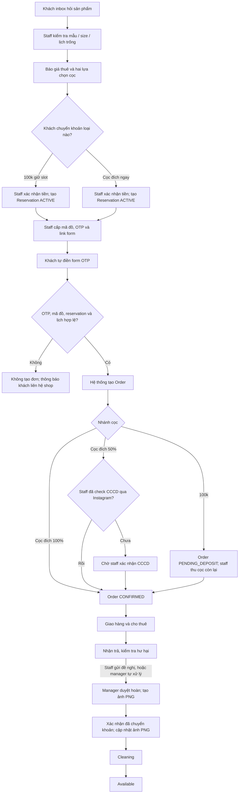
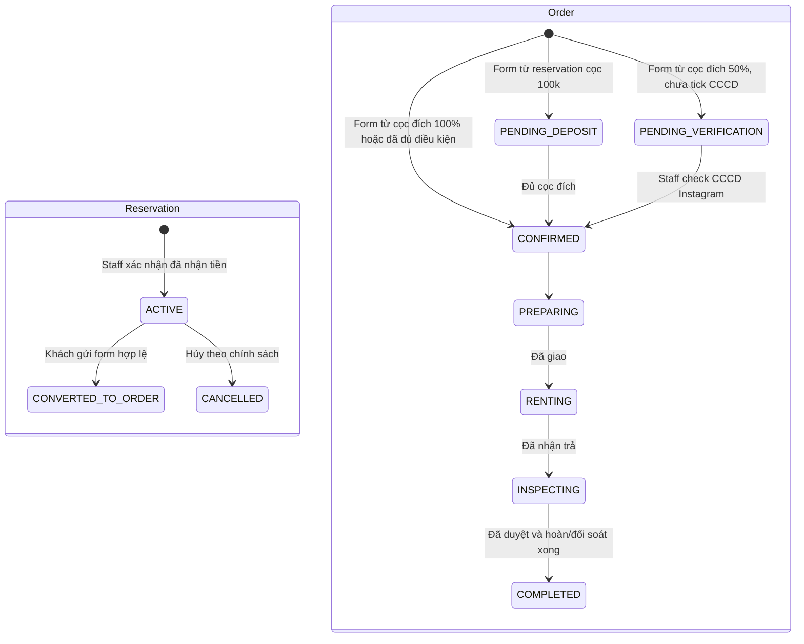
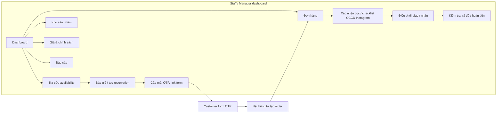

# Thiết kế hệ thống — Aura Rental

> Web nội bộ cho staff/manager quản lý cho thuê váy, phụ kiện và tiền cọc. Khách chỉ dùng form OTP; hệ thống **chỉ tự tạo đơn khi khách gửi form hợp lệ**. Giao diện ưu tiên mobile, thao tác nhanh và không double-book mã đồ.

## 1. Vai trò và phạm vi

| Vai trò | Quyền chính |
|---|---|
| **Staff** | Kiểm tra availability, tư vấn giá, xác nhận giao dịch, tạo reservation, cấp mã/OTP/link form, xác nhận cọc còn lại, giao/nhận đồ, ghi nhận hư hại và gửi đề nghị hoàn tiền. **Không tạo đơn thủ công.** |
| **Manager** | Toàn quyền staff; cấu hình catalog/giá/chính sách; duyệt hoàn tiền; xem báo cáo và audit log. |
| **Khách** | Nhận link, nhập OTP/mã đồ và tự gửi form. Không vào dashboard. |

Ngoài phạm vi MVP: thanh toán online tự động, đồng bộ hãng vận chuyển và website catalogue công khai.

## 2. Quyết định nghiệp vụ đã chốt

### 2.1. Sản phẩm và mã vật lý

```text
Sản phẩm: Afrodille gấm
└── Variant: Afrodille gấm · Size S
    ├── AF-GAM-S-01  (một chiếc váy vật lý)
    ├── AF-GAM-S-02  (một chiếc váy vật lý)
    └── AF-GAM-S-03  (một chiếc váy vật lý)
```

- `inventory_item` là **một chiếc đồ vật lý**, thuộc duy nhất một mẫu/màu/chất liệu/size; mỗi item có `asset_code` duy nhất.
- Số lượng của một mẫu + size được hệ thống tự đếm từ các `inventory_item`, không nhập tay. Ví dụ: Afrodille gấm size S có 19 mã vật lý.
- Một mã vật lý không được có hai reservation/đơn active giao thời gian, tính cả buffer cleaning. Nếu staff chỉ chọn mẫu + size, backend tự gán một mã trống khi tạo reservation; MVP không giữ capacity chưa có mã. Staff/manager có thể đổi mã trong transaction nếu mã mới vẫn trống.

### 2.2. Reservation thay cho hold ngắn hạn

Không có `INQUIRY_HOLD`. Khách mới hỏi đồ chưa tạo bản ghi khóa lịch.

`reservation` chỉ được tạo khi staff đã xác nhận khách **đã chuyển tiền**. Reservation giữ lịch/suất sản phẩm và có thể tồn tại lâu để khách xoay đủ tiền; không dùng expiry cố định 2 giờ.

Reservation cọc giữ slot vẫn giữ lịch cho đến khi khách gửi form hoặc staff hủy thủ công. Nếu khách chưa gửi form, staff có thể nhắc hoặc cấp lại OTP.

### 2.3. Hai nhánh tiền cọc

| Nhánh | Tiền khách đã chuyển | Reservation | Sau khi khách gửi form |
|---|---:|---|---|
| **Cọc giữ slot** | 100.000đ | `ACTIVE`, tiền được ghi `slot_reservation` | Hệ thống tạo order `PENDING_DEPOSIT`; cọc còn lại = cọc đích − 100.000đ. |
| **Cọc đích ngay** | 50% giá trị váy + CCCD, hoặc 100% giá trị váy | `ACTIVE`, đã đạt tiền cọc mục tiêu | Hệ thống tạo order `CONFIRMED` nếu đủ điều kiện; gói 50% cần staff tick đã kiểm tra CCCD. |

- Giá trị 100.000đ luôn được cộng vào tổng cọc đã nhận sau khi reservation chuyển thành đơn.
- Khách có thể cọc 100.000đ để giữ slot và chờ xoay tiền; không cần đến thử đồ và không có trạng thái fitting.
- Nếu khách đổi sản phẩm/size, hệ thống snapshot lại giá trị váy và tính `cọc còn lại = cọc đích mới − tổng tiền đã nhận`.
- Chính sách khi hủy reservation (mất/hoàn/bảo lưu 100.000đ) chưa được chốt; hệ thống phải lưu lý do và quyết định staff/manager, không tự xóa giao dịch.

### 2.4. CCCD qua Instagram

- Ảnh/số CCCD được nhận và kiểm tra qua Instagram, **không upload vào form và không lưu trong hệ thống**.
- Với gói `50% + CCCD`, staff chỉ tick `Đã kiểm tra CCCD qua Instagram`; hệ thống lưu `verified_by` và `verified_at`, không lưu dữ liệu CCCD.
- Gói 100% không yêu cầu checklist này.
- Form khách không kiểm tra, không parse và không yêu cầu file CCCD.

### 2.5. Giá thuê và hoàn tiền

- Giá là snapshot tại báo giá/đơn, không bị thay đổi khi manager sửa bảng giá sau này.
- Gói 12h, 1 ngày, 3 ngày là giá cố định. Từ ngày thứ 4: mỗi ngày thêm `10% × giá gói 1 ngày`; tỷ lệ cấu hình được.
- Phí thuê luôn được khấu trừ từ cọc khi hoàn đồ, không thu thành giao dịch phí thuê riêng.
- `tiền hoàn = tổng cọc đã nhận − phí thuê thực tế − phí xử lý hư hại`.
- Không hoàn âm. Nếu cọc không đủ, ghi `additional_collection` cần thu thêm.
- Staff kiểm tra và gửi đề nghị hoàn cho manager. Manager có toàn quyền kiểm tra/đối soát và duyệt trực tiếp; không bắt buộc có bước staff gửi đề nghị trước.
- Manager được điều chỉnh yêu cầu đang chờ hoặc trả về staff kiểm tra lại. Sau khi duyệt nhưng chưa chuyển khoản, điều chỉnh cần lý do và duyệt lại, lưu phiên bản trước và tạo ảnh mới.
- Duyệt hoàn và xác nhận đã chuyển khoản là hai thao tác riêng. Ảnh PNG thể hiện đúng trạng thái, mã đơn, các món đã thuê, giá thuê, phí xử lý, cọc ban đầu và tiền hoàn; không hiển thị các mốc thời gian. Hỗ trợ copy ảnh và tải PNG.

## 3. Luồng nghiệp vụ



### Vòng đời reservation và order



`Reservation` và `Order` là hai thực thể riêng. Reservation có thể chưa bao giờ thành đơn; Order không được staff tạo trực tiếp. Trạng thái kiểm tra/duyệt hoàn/chi trả thuộc hồ sơ trả đồ và bản duyệt, không gộp vào status đơn. Đủ cọc và checklist CCCD (nếu chọn 50%) đều là điều kiện để CONFIRMED.

## 4. Screen flow và module



| Khu vực | Màn hình | Nội dung chính |
|---|---|---|
| Dashboard | Hôm nay | Đơn cần cọc, giữ chỗ đang hoạt động, lịch giao/nhận, tiền cần hoàn. |
| Lịch tồn kho | Tra cứu availability | Tìm mẫu/mã, size, thời gian nhận/trả; trả về các mã trống. Đây là màn mặc định. |
| Lịch tồn kho | Tổng quan kho | Nhóm theo mẫu + size: số mã trống / thuê / reservation / cleaning; chỉ mở timeline khi cần. |
| Reservation | Báo giá & giữ slot | Chọn lịch, sản phẩm, loại tiền khách đã trả; ghi nhận chứng từ và cấp mã/OTP/link. Không tạo order. |
| Đơn hàng | Danh sách/chi tiết | Đơn do hệ thống tạo, timeline, payment ledger, checklist CCCD Instagram, giao/nhận, hư hại, hoàn tiền. |
| Kho | Catalog & mã vật lý | Mẫu, variant-size, ảnh, giá trị thay thế, mã vật lý, cleaning/maintenance. |
| Cấu hình | Chính sách | Bảng giá, tỷ lệ ngày thêm, số tiền reservation 100k và quy tắc hủy. |
| Customer | Form OTP | Liên hệ, mã đồ, lịch, địa chỉ, gói cọc và ghi chú; không có upload CCCD. |

### Lịch tồn kho khi có hàng nghìn mã

Không render bảng timeline của toàn bộ mã đồ.

1. **Search-first:** staff nhập mã/tên mẫu, size, ngày nhận-trả; backend trả mã/suất trống.
2. **Aggregate-first:** nhóm theo mẫu + size, ví dụ `Afrodille gấm S: trống 12 | thuê 4 | reservation 1 | cleaning 2`.
3. **Timeline on demand:** chỉ khi mở một nhóm/mã mới tải timeline chi tiết của nhóm đó.
4. **Operations queue:** danh sách độc lập chỉ gồm giao, nhận và reservation đang hoạt động của hôm nay/7 ngày tới.
5. Mobile dùng form tra cứu + kết quả dạng danh sách; không hiển thị ma trận toàn kho.

## 5. Contract customer form

Form nhận OTP và mã staff đã cấp. Khách tự điền họ tên, số điện thoại, địa chỉ giao/nhận, lịch thuê, gói cọc và ghi chú. Form không nhận CCCD.

Khi submit, backend thực hiện trong một transaction:

1. Xác thực OTP chưa hết hạn/chưa dùng và mã hàng thuộc reservation active.
2. Kiểm tra dữ liệu bắt buộc và availability tại đúng thời điểm submit.
3. Copy giá/tỷ lệ đã chốt từ reservation items sang `orders`, `order_items`; đọc ledger qua `reservation_id` (không chuyển/nhân đôi payment); chuyển reservation thành `CONVERTED_TO_ORDER`. Lịch bận sau chuyển đổi đọc qua order thay cho reservation active.
4. Xác định trạng thái order: `PENDING_DEPOSIT`, `PENDING_VERIFICATION` hoặc `CONFIRMED` theo nhánh cọc.
5. Đánh dấu OTP đã dùng, gửi notification và trả `order_no`.

Nếu OTP/mã/reservation không hợp lệ hoặc phát sinh xung đột, không tạo order. Request submit lặp lại trả về cùng `order_no` (idempotent), không tạo đơn thứ hai.

## 6. Database design

Thiết kế tối giản 13 bảng và ERD: [database/README.md](database/README.md). Các bảng/thuộc tính PostgreSQL: [database/schema.sql](database/schema.sql). Không trigger, stored function, exclusion constraint hay bảng hạ tầng audit/outbox trong bản này.

Các quyết định dữ liệu chính:

- Catalog `products → product_variants → inventory_items`; ảnh lưu danh sách path trên product. Giá thuê hiện tại theo variant/gói, settings một dòng cho cọc slot/tỷ lệ ngày thêm/cleaning mặc định. Số lượng lấy từ mã vật lý.
- Reservation gán mã nội bộ ngay khi nhận tiền; backend kiểm tra lịch qua reservation/order items và cleaning buffer bằng transaction + lock mã vật lý. Không bảng availability blocks riêng.
- `payments.reservation_id` là liên kết ledger ổn định trước/sau khi có đơn; không nhân đôi tiền cọc. Không ghi khoản phí khấu trừ như một khoản tiền khách đã chuyển riêng.
- OTP/hash/link/hạn dùng nằm trên reservation, không bảng token/submission riêng; một reservation có tối đa một order. Thông tin giao/nhận, checklist CCCD và settled nằm trên order.
- Kiểm tra tình trạng, phí thực tế, phí xử lý và ảnh hư hại nằm trên `order_items`. `refunds` lưu một dòng cho mỗi phiên bản đối soát với totals và `items_snapshot` JSON. Manager được `DRAFT → APPROVED` trực tiếp, không bắt buộc staff gửi.
- Backend không cho sửa dữ liệu đã duyệt; điều chỉnh trước chuyển khoản tạo phiên bản mới có lý do, duyệt lại mới thay thế bản cũ. Không chi/copy ảnh khi đang có bản điều chỉnh mở.
- Approval khác payout: payment hoàn confirmed gắn bản duyệt, đúng số tiền và chỉ một lần/đơn do backend kiểm tra. Hoàn 0đ set settled trên order, không tạo giao dịch 0đ.
- PNG sinh từ snapshot của phiếu duyệt + trạng thái đối soát trên order, không bảng tài liệu ảnh riêng và không timeline gửi khách. Timestamp vẫn cần cho lịch thuê/cleaning.
- DDL chỉ PK/FK/unique cơ bản. Backend thực hiện role/state validation, tính tiền, chống trùng lịch, duyệt/chi lặp bằng transaction + lock. Không có audit/outbox/notification persisted hoặc module đảo giao dịch ở bản tối giản; thêm khi có nhu cầu thực tế.
- Schema nghiệp vụ `aura` chỉ backend .NET truy cập, không expose cho frontend Supabase API. Đây là thiết kế/baseline, chưa áp dụng lên database thật.

## 7. Công thức tiền

```text
rental_fee = price(selected_package)
if rental_days > 3:
  rental_fee += ceil(rental_days - 3) × one_day_price × extra_day_rate

deposit_target = sum(replacement_value_snapshot) × (50% hoặc 100%)
total_deposit_received = confirmed(slot_reservation + target_deposit)
deposit_remaining = max(0, deposit_target - total_deposit_received)
damage_fee = processing_fee trong refunds của bản APPROVED
refund_amount = max(0, total_deposit_received - actual_rental_fee - damage_fee)
additional_collection = max(0, actual_rental_fee + damage_fee - total_deposit_received)
```

Ví dụ: váy trị giá 1.200.000đ, thuê 3 ngày 320.000đ, khách đã cọc giữ slot 100.000đ và chọn gói 50%. Cọc đích là 600.000đ, còn thiếu 500.000đ. Không hư hại thì hoàn `600.000 − 320.000 = 280.000đ`.

## 8. Service/API boundary

| Nhóm | Hành động chính |
|---|---|
| Availability | `GET /availability` theo variant/mã + khoảng thuê; trả mã/suất trống. |
| Reservations | Tạo sau khi xác nhận tiền, thêm item, hủy, cấp lại OTP; không tạo order. |
| Customer OTP | Verify OTP và submit form idempotent; backend tự chuyển reservation thành order. |
| Orders | List/filter/detail, transition state, assign mã vật lý, checklist CCCD Instagram. Không có endpoint tạo order cho staff. |
| Payments | Ghi nhận chứng từ, xác nhận payment, tính cọc còn lại, hoàn tiền/thu thêm. |
| Returns & refunds | Queue chung, kiểm tra, gửi đề nghị tùy chọn, manager duyệt trực tiếp, phiên bản điều chỉnh có lý do, xác nhận chuyển khoản/đối soát, PNG theo bản duyệt. |
| Fulfillment | Shipment, check-in/check-out, hư hại, cleaning. |
| Notifications | In-app realtime; adapter SMS/Zalo/email sau này. |

## 9. Notification, security và UX

| Sự kiện | Người nhận | Hành động |
|---|---|---|
| Customer form tạo order | Staff phụ trách, Manager | Notification mở thẳng order mới. |
| Gói 50% chưa checklist CCCD | Staff | Nhắc check Instagram trước khi confirm order. |
| Đơn giao/nhận hôm nay, trễ hạn, hoàn tiền chờ duyệt | Staff/Manager | Dashboard và notification. |
| Giá, tiền, lịch hoặc trạng thái thay đổi | Manager | Audit notification. |

- Không lưu CCCD, không có upload field hoặc private storage cho CCCD.
- RBAC, MFA cho manager, audit log bất biến, backup hằng ngày; mask số điện thoại khi phù hợp.
- Mobile: bottom navigation, form theo bước, nút xác nhận cố định; lịch lớn chuyển thành search/list.
- Mọi thay đổi tiền/trạng thái cần idempotency key và backend validation.

## 10. MVP và hướng dẫn vận hành

### Thứ tự build

1. RBAC, catalog/variant/mã vật lý, bảng giá và policy.
2. Availability search chống trùng, reservation sau payment, deadline và OTP/form.
3. Tự tạo order, payment ledger, checklist CCCD Instagram, giao/nhận, audit log.
4. Hư hại, hoàn tiền, cleaning; dashboard/notification/báo cáo.

### Staff — từng module

1. **Lịch tồn kho:** search mẫu/size/khoảng thuê, chọn mã hoặc suất còn trống.
2. **Reservation:** báo giá; xác nhận khách đã chuyển 100k hoặc cọc đích; ghi chứng từ; khóa lịch/suất.
3. **Cấp mã & form:** gửi mã đồ, OTP và link. Staff không tạo order.
4. **Đơn mới:** khi khách gửi form, kiểm tra timeline/cọc. Nhánh 100k: thu và xác nhận cọc còn lại. Nhánh 50%: tick đã check CCCD qua Instagram. Nhánh 100%: không cần checklist.
5. **Giao/nhận:** cập nhật shipment, nhận trả, ảnh tình trạng/hư hại, gửi đề nghị hoàn.

### Manager — từng module

1. Theo dõi reservation đang hoạt động, order mới, đơn trễ trả và các yêu cầu hoàn.
2. Quản lý mã vật lý, giá, tỷ lệ ngày thêm và chính sách hủy reservation.
3. Duyệt hoàn tiền, khoản thu thêm và các thay đổi ngoại lệ; xem audit/báo cáo.

### Khách — từng bước

1. Inbox shop, chọn sản phẩm/lịch và chuyển 100k hoặc cọc đích.
2. Nhận mã đồ, OTP/link form từ staff; tự điền liên hệ, lịch, địa chỉ, gói cọc và ghi chú. Không gửi CCCD qua form.
3. Nếu gói 50%, gửi CCCD qua Instagram để staff kiểm tra.
4. Nhận mã order/số cọc còn lại (nếu cọc 100k); thanh toán phần còn lại theo hướng dẫn.
5. Nhận đồ, trả đồ; nhận hoàn tiền sau khi phí thuê và hư hại (nếu có) được khấu trừ.

**Tiêu chí nghiệm thu MVP:** staff xử lý được từ payment → reservation → form khách → order → hoàn tiền trên điện thoại; không double-book; data CCCD không vào hệ thống; tất cả thay đổi tiền/trạng thái có audit log.
